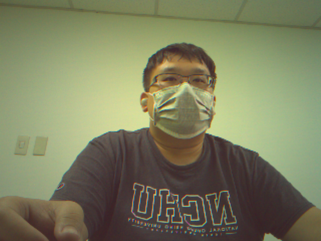

# 📸 Mini-ISP: A RAW to Image Processing Pipeline

Here's an example of a DNG RAW image processed into a viewable PNG using this Mini-ISP pipeline:



*(Image: A RAW (.dng) file successfully converted to a viewable PNG image by Mini-ISP.)*


This is a lightweight Image Signal Processor (ISP) pipeline implemented in C++ and OpenCV. Its primary function is to convert raw .dng (Digital Negative) files from digital cameras into viewable image formats (e.g., .png).

**Note on Hardware & CCM:** This ISP was developed and tested primarily with RAW data captured from a **Raspberry Pi 3B+** equipped with an **OV5647** camera module. Consequently, the **Color Correction Matrix (CCM)** extracted from these specific DNG files (`ccm_mat` in the code) is **tailored to the OV5647 sensor**. It's important to understand that CCMs are sensor-specific and may not be universally applicable to DNGs from other cameras or sensors.


## ✨ Project Overview
### What Does Mini-ISP Do?
Mini-ISP aims to simulate the internal process within a digital camera, from acquiring raw data from the image sensor to generating a final viewable picture. This processing pipeline includes several critical image processing steps to ensure that RAW data is correctly interpreted, color-corrected, and ultimately presented in a human-eye-friendly manner.

### The current processing pipeline includes:

#### RAW File Reading (.dng):

Utilizes the LibRaw library to read .dng format raw image data and extract camera metadata (such as Bayer pattern, white balance coefficients, and color correction matrix).

#### Bayer Pattern Identification & Mask Generation:

Generates pixel masks for R, G, and B channels based on the Bayer array pattern of the RAW data.

#### Initial Channel Assignment:

Distributes the single-channel RAW data into a three-channel color image structure according to the Bayer pattern. At this stage, only one color channel has a value at each pixel location; others are zero.

#### Demosaicing:

For the assigned image, missing color channel data is interpolated to reconstruct a full-color image. Currently, it uses the Nearest Neighbor Interpolation method.

Automatic White Balance (AWB):

Adjusts the image's color balance using the cam_mul coefficients provided in the DNG file to eliminate color casts.

#### Color Correction Matrix (CCM):

Applies the camera's built-in CCM to transform the image from the camera's native color space to a standard color space (like sRGB) for more accurate color representation.

#### Gamma Correction:

Applies a gamma curve to adjust the image's luminance response, making it more visually appealing to the human eye and adapting it for display devices.

#### Image Output:

Converts the processed floating-point image to an 8-bit integer image, then saves it to a common image format (like .png) or displays it in real-time.

### 🛠️ Compilation and Usage
#### Dependencies
Before compiling Mini-ISP, ensure you have the following libraries installed on your system:

**CMake** (version 3.10 or higher): For cross-platform project building.

**OpenCV** (version 4.x or higher): Provides extensive image processing functionalities.

**LibRaw** (version 0.20 or higher): For parsing and reading RAW format files.

#### Compilation Steps
This project uses CMake for its build system. Follow these steps to compile:

**1. Clone the repository:**
```
git clone https://github.com/wuyiulin/mini_isp.git
cd mini_isp
```

**2. Create and enter the build directory:**
```
mkdir build
cd build
```

**3. Configure the CMake project:**
```
cmake ..
```
- CMake will check your system dependencies and generate build files (e.g., Makefile or Visual Studio project files).

**4. Compile the project:**
```
make -j$(nproc) # For Linux/macOS
# or
# cmake --build . --config Release # For Windows Visual Studio
```
- make -j$(nproc) will use all available CPU cores to speed up compilation.

#### Usage
After successful compilation, you will find the mini_isp executable in the build/ directory.
```
./mini_isp <input.dng> [output.png] [bayer.pattern] [gamma_value] [simulated_mode]
```
- <input.dng>: Required. Path to the input DNG file to be processed.

- [output.png]: Optional. Path to save the processed image. If not specified, the image will not be saved but will still be displayed. Defaults to saved ./output.png.

- [bayer.pattern]: Optional. Manually specify the Bayer pattern (e.g., RGGB). If not specified, the program will attempt to extract it from the DNG metadata. Defaults to RGGB.


- [gamma_value]: Optional. Specify the gamma correction value (e.g., 2.2 for standard). Defaults to 2.2.

- [simulated_mode (1/0)]: Optional. Set to 1 (true) to enable an internal simulated data test mode, which will bypass DNG file reading. Defaults to 0 (false).

**Examples:**
**1. Process a DNG file and save as PNG:**
```
./mini_isp ../data/example.dng ../data/output.png RGGB 2.2 0
```
**2. Enable simulated data test mode:**
```
./mini_isp dummy.dng test_simulated.png RGGB 2.2 true
# Note: 'dummy.dng' is just a placeholder and will not be read in simulated mode.
```

### 🚧 Current Support & Future Development
#### Supported Bayer Patterns
Currently, Mini-ISP's demosaicing and Bayer mask generation functions only support the RGGB Bayer pattern.

This means that for DNG files with other Bayer patterns, the program may not process them correctly or might report an error.

Features Under Development
We are actively working on adding support for more Bayer patterns, including but not limited to:

**- RGBE**

**- GMCY**

**- GRTG**

and more Automatic white balance (AWB) algorithms, including but not limited to Perfect Reflector Assumption.

We will update this documentation and the project code as soon as these patterns are supported. Contributions are welcome!

### 📂 Project Structure
```
├── build
├── CMakeLists.txt
├── data
│   ├── ccm.txt
│   ├── disturbed_pictures.raw
│   ├── face.dng
│   └── purple_face.jpg
├── include
│   ├── Demosaic.hpp
│   ├── ImageIO.hpp
│   └── Utils.hpp
├── main.cpp
├── README.md
├── src
│   ├── Demosaic.cpp
│   ├── ImageIO.cpp
│   └── Utils.cpp
└── utils
    └── ISP_pipeline.py # Python ISP pipeline implementation
    ├── AWB.py
    └── gamma.py
```

## 🚧 Author's Murmurs
Building an ISP pipeline from scratch has been a challenging yet rewarding journey. Here are a couple of common pitfalls I encountered during development, hoping to save you some headaches!

### 1. The Elusive 10-bit Decompression and Bayer Pattern Mix-up

One of the first major hurdles was correctly handling the RAW data's bit depth and its corresponding Bayer pattern. It's easy to assume 8-bit, but real RAW files often come in 10-bit, 12-bit, or even 14-bit formats. Misinterpreting this can lead to incorrect scaling and pixel value ranges.

On top of that, confusing the Bayer pattern (e.g., assuming RGGB when it's actually GRBG) directly impacts demosaicing. If the pattern is wrong, your interpolated colors will be completely off, resulting in a checkerboard or strongly tinted image.

Here's an example of what can happen when the Bayer pattern is misidentified or the decompression isn't handled correctly, leading to severe color artifacts and incorrect demosaicing:


*(Image 1: Example of demosaicing artifacts due to incorrect 10-bit decompression or Bayer pattern mismatch.)*

### 2. Pixel Value Out-of-Bounds During Image Processing

Another tricky aspect, especially when working with floating-point pixel values (0.0 to 1.0) and then converting back to 8-bit (0-255), is managing pixel values. Operations like white balancing or color correction can easily push pixel values beyond the valid [0.0, 1.0] range.

If you don't properly **clip (clamp)** these values back to the valid range before converting to 8-bit, you'll end up with blown-out highlights (pure white where it shouldn't be) or crushed shadows (pure black where it shouldn't be), or even unexpected color shifts due to integer overflow/underflow if not handled correctly. This can significantly degrade the final image quality.

This image shows the effect of unclipped pixel values, where bright areas are completely washed out and detail is lost:


*(Image 2: Example of blown-out highlights and loss of detail due to unclipped pixel values.)*
